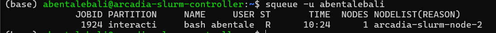
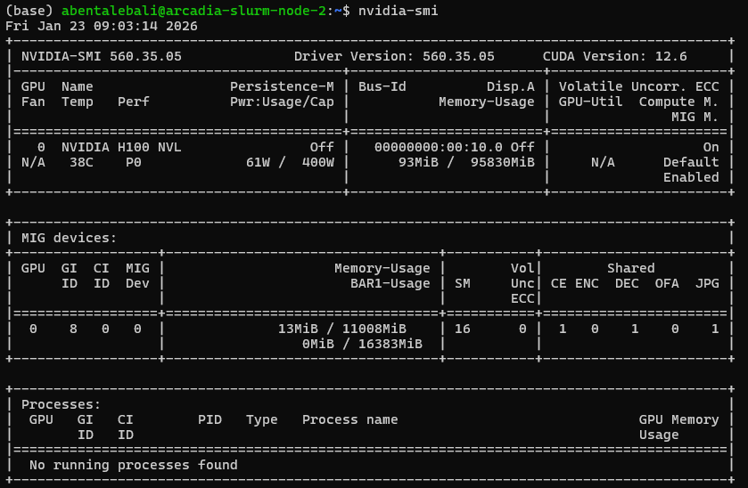
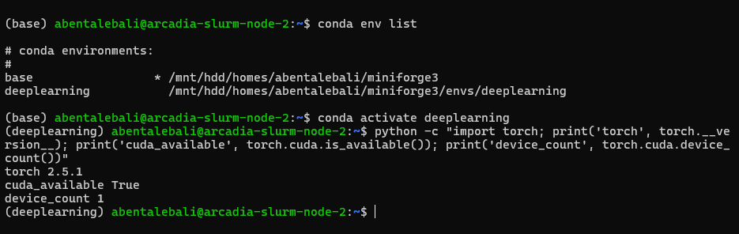
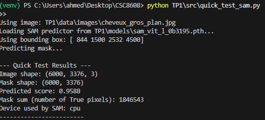
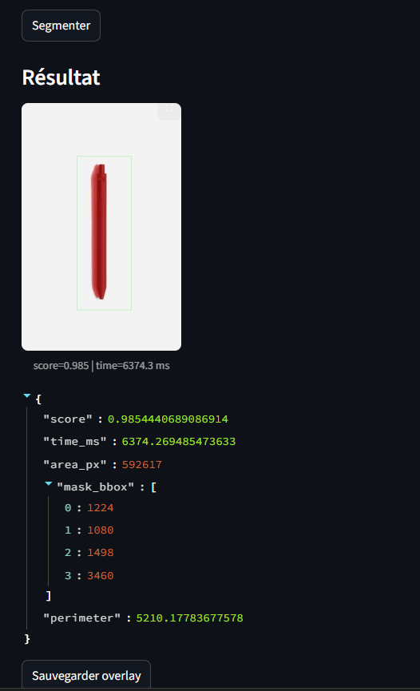
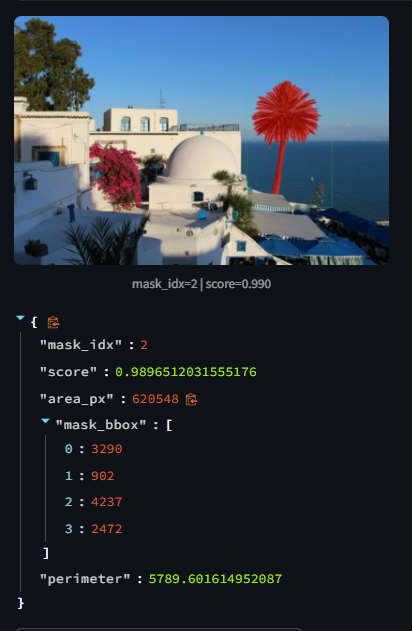

CSC 8608 – Concepts avancés et applications du deep learning

# Rapport TP1 : Modern Computer Vision

**Ahmed Ben Taleb Ali**

Dépot git :  [ahmedbta/CSC8608](https://github.com/ahmedbta/CSC8608/)

## Exercice 1 : Initialisation du dépôt, réservation GPU, et lancement de la UI via SSH

## Réservation GPU + environnement

- Réservation via SLURM (partition interactive) :

### GPU

### PyTorch/CUDA

Après réflexion, je vais le lancer sur le local car j'ai déjà tout installé sur mon local 

## Exercice 2 : Constituer un mini-dataset (jusqu’à 20 images)

### Mini-dataset d’images

#### Nombre total d’images
Le mini-dataset contient **8 images** stockées dans le dossier `data/images/`.

#### Images représentatives (sélection de 5)

- `data/images/pomme_rouge.jpg` — objet unique bien centré (cas simple).
- `data/images/cuillere.jpg` — objet fin + reflets (cas difficile/ambigu).
- `data/images/velo_mur_briques.png` — objet principal + fond texturé (intermédiaire).
- `data/images/reflets_flaque_urbaine.jpg` — reflets et ambiguïtés (cas difficile).
- `data/images/rue_urbaine_moto.jpg` — scène urbaine chargée (cas chargé).

#### Captures demandées

**Cas simple :**  

**Cas difficile :**  

## Exercice 3 : Charger SAM (GPU) et préparer une inférence “bounding box → masque”

### Chargement de SAM et inférence par boîte englobante vers masque

  #### Modèle et Checkpoint Utilisés:
   * Modèle Choisis: `vit_l`
   * Fichier Checkpoint: `sam_vit_l_0b3195.pth`

  #### Capture d'Écran du Test Rapide (Sortie Console):

  #### Premier Constat:
  Le Segment Anything Model (SAM) avec le checkpoint `vit_l` se charge et s'initialise avec succès sur le périphérique CUDA. La fonction `predict_mask_from_box` traite correctement une image d'entrée et une boîte englobante, renvoyant un masque binaire aux dimensions attendues et un score de confiance élevé. Cela confirme que le mécanisme d'inférence principal pour la génération de masques à partir de boîtes englobantes est fonctionnel, même si c'est un peu lent.

## Exercice 4 :
  ### 1. Capture d'Écran d'un Overlay Produit:
  

  ### 2. Mini-Table des Métriques:

  ### Résultats des tests rapides (quick_test_overlay)

| Image | Checkpoint | Device | Bounding box (x1,y1,x2,y2) | Score | Aire masque (px) | BBox masque (x1,y1,x2,y2) | Périmètre approx. | Overlay |
|---|---|---:|---:|---:|---:|---:|---:|---|
| `data/images/rue_urbaine_moto.jpg` | `sam_vit_l_0b3195.pth` | cpu | [500, 750, 1500, 2250] | 0.9122 | 394823 | (932, 563, 1504, 2194) | 5976.45 | `outputs/overlays/overlay_rue_urbaine_moto.png` |
| `data/images/village_mediterraneen_mer.jpg` | `sam_vit_l_0b3195.pth` | cpu | [1296, 864, 3888, 2592] | 0.9179 | 1454783 | (1241, 1282, 3824, 2677) | 11893.87 | `outputs/overlays/overlay_village_mediterraneen_mer.png` |
| `data/images/pomme_rouge.jpg` | `sam_vit_l_0b3195.pth` | cpu | [905, 1358, 2716, 4074] | 1.0095 | 1351234 | (1176, 2328, 2450, 3742) | 4698.69 | `outputs/overlays/overlay_pomme_rouge.png` |

#### Commentaire :

L'overlay combinant l'image originale, la boîte englobante et le masque segmenté s'est avéré être un outil visuel très utile pour déboguer le modèle et les prompts. Il permet une inspection immédiate de la qualité de la segmentation. Par exemple, en cas de détection incorrecte, un overlay clair met en évidence si la boîte englobante initiale était mal positionnée ou si le modèle SAM n'a pas réussi à identifier correctement les bords de l'objet. Cela aide à comprendre les limites du modèle, à ajuster les prompts (boîtes) pour de meilleures performances, ou à identifier les cas où le modèle nécessite plus d'affinements.

## Exercice 5 :

### Cas simple

Image : `velo_mur_briques.png`

Scène simple avec un objet principal bien visible.

Segmentation précise et stable.

Score élevé (≈ 0.99).

### Cas difficile

Image : `rue_urbaine_moto.jpg`

Scène urbaine complexe (plusieurs objets, arrière-plan chargé).

Segmentation correcte mais sensible à la taille de la bounding box.

Pour d'autres images :

| Image                         | Bounding box (x1, y1, x2, y2) | Score | Aire (px) | Temps (ms) |
| ----------------------------- | ----------------------------- | ----- | --------- | ---------- |
| `rue_urbaine_moto.jpg`          | [500, 750, 1500, 2250]        | 0.912 | 394 823   | 6402       |
| `village_mediterraneen_mer.jpg` | [1296, 864, 3888, 2592]       | 0.918 | 1 454 783 | 6290       |
| `pomme_rouge.jpg`               | [905, 1358, 2716, 4074]       | 1.009 | 1 351 234 | 6374       |

La taille et le positionnement de la boîte englobante ont un impact direct sur la qualité
du masque généré par SAM.

Lorsque la boîte englobante est **trop petite**, certaines parties de l’objet peuvent être
exclues, ce qui conduit à un masque incomplet ou fragmenté.  
À l’inverse, une boîte englobante **trop large** inclut davantage de contexte (arrière-plan,
objets voisins), ce qui peut entraîner une segmentation moins précise et une aire
segmentée plus importante que l’objet réel.

Dans les scènes simples, SAM reste relativement robuste aux variations de la boîte englobante. En revanche, dans les scènes urbaines complexes, une boîte englobante légèrement plus
large que l’objet cible donne souvent de meilleurs résultats qu’une boîte englobante trop serrée.

Globalement, un compromis est nécessaire : la boîte englobante doit couvrir entièrement
l’objet tout en limitant autant que possible le contexte inutile.

## Exercice 6 :

### Cas sans point 

### Cas avec points FG et BG

#### Effet de la boîte englobante sur la segmentation

Les résultats montrent que la qualité de la segmentation dépend fortement de la taille et du positionnement de la boîte englobante.
Une bbox trop large inclut des éléments du fond (murs, sol, véhicules), ce qui peut amener SAM à segmenter des régions non désirées ou à produire un masque trop étendu.
À l’inverse, une bbox trop serrée peut couper des parties importantes de l’objet, ce qui dégrade le masque final (objets partiellement segmentés, contours incomplets).
Lors des tests sur `rue_urbaine_moto.jpg`, une bbox large englobant toute la rue donne un masque incluant la chaussée, tandis qu’une bbox centrée sur la moto améliore la précision mais réduit parfois la continuité du masque.
Cela montre que SAM reste sensible au contexte imposé par la bbox, même s’il est robuste.

#### Comparaison entre cas simple et cas difficile

Sur des cas simples (ex. `stylo_noir.jpg`, `pomme_rouge.jpg`), le modèle produit des masques très précis avec des scores élevés (>0.98), des contours nets et peu d’ambiguïté.
En revanche, sur des cas complexes comme `rue_urbaine_moto.jpg`, la segmentation est plus instable : le masque peut inclure le sol ou manquer certaines parties fines (roues, guidon).
Les difficultés proviennent principalement du fond très chargé, des textures répétitives et des occlusions partielles.
Cela confirme que SAM fonctionne très bien pour des objets isolés, mais que ses performances diminuent lorsque la scène devient dense et ambiguë.

## Exercice 7 — Bilan et réflexion (POC → produit)

### Facteurs d’échec de la segmentation et pistes d’amélioration

Trois facteurs principaux expliquent les échecs observés.
Premièrement, les fonds complexes et texturés (rues, bâtiments) induisent des confusions entre objet et arrière-plan ; une solution serait d’ajouter des points négatifs (points d'arrière-plan) ou un post-traitement morphologique.
Deuxièmement, les objets fins ou partiellement occlus (roues, cheveux, reflets) sont mal segmentés ; cela pourrait être amélioré par des boîtes englobantes hiérarchiques ou des prompts multiples.
Troisièmement, l’ambiguïté de la `bbox` (trop large ou mal centrée) dégrade fortement le résultat ; une `UI` plus interactive (drag & resize, feedback visuel plus précis) aiderait l’utilisateur.
À plus long terme, un dataset ciblé par domaine et un recalibrage des prompts permettraient d’augmenter la robustesse.

### Industrialisation : logging et monitoring prioritaires

Pour une mise en production, il serait essentiel de `logger` et `monitorer` plusieurs signaux.
En priorité : (1) le `score de prédiction SAM` pour détecter une baisse de confiance, (2) le `temps d’inférence` pour surveiller les régressions de performance, (3) la taille relative du masque (`aire / image`) pour repérer des segmentations aberrantes, (4) les dimensions et ratios des `bboxes` utilisateur, et (5) le taux d’échec ou de retraitement (nouvelle `bbox` après un mauvais résultat).
Ces métriques permettraient de détecter du `drift de données`, des problèmes d’`UX` ou des changements de comportement du modèle après mise à jour.
Combinées à des échantillons d’`overlays` sauvegardés, elles offriraient une bonne observabilité du système.