# Rapport TP2

## Mise en place & smoke test (GPU + Diffusers)

### Exécution du smoke test

Le smoke test a été exécuté avec succès, confirmant l'utilisation du GPU (`cuda`) avec une précision `torch.float16`. Une image (`smoke.png`) a été générée et sauvegardée dans `TP2/outputs/`.

**Commande d'exécution:**
`python TP2/smoke_test.py`

**Sortie console (extraits):**
```
[smoke] device=cuda dtype=torch.float16
...
[smoke] saved: TP2/outputs\smoke.png
```

### Image générée

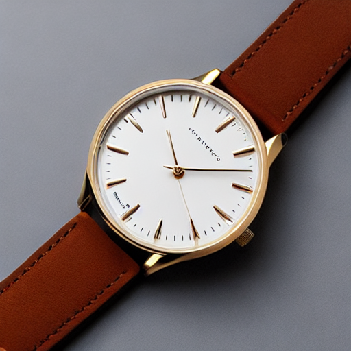

### Problèmes rencontrés et résolution (Smoke Test)

Le test a révélé un avertissement concernant l'indisponibilité de `xformers` dû à l'absence du module `triton`. Comme mentionné précédemment dans le rapport, cette optimisation a été désactivée temporairement pour permettre la poursuite des expériences. Le test a néanmoins été concluant.

---

## Factoriser le chargement du pipeline & Baseline Text2Img

### Fichier `pipeline_utils.py`

Le fichier `TP2/pipeline_utils.py` a été créé pour centraliser le chargement des pipelines et la gestion des paramètres, facilitant la réutilisation et la reproductibilité.

### Image Text2Img "baseline"

Une image Text2Img "baseline" a été générée avec des paramètres par défaut, servant de point de comparaison pour les expériences futures.

**Configuration:**
```json
{
    "model_id": "runwayml/stable-diffusion-v1-5",
    "scheduler": "EulerA",
    "seed": 42,
    "steps": 30,
    "guidance": 7.5
}
```

### Image générée (baseline.png)

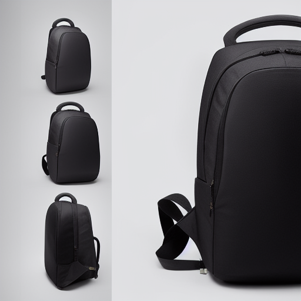

---

## Text2Img : 6 expériences contrôlées (paramètres steps, guidance, scheduler)

Ces expériences visent à comprendre l'impact des paramètres `num_inference_steps`, `guidance_scale` et `scheduler` sur la qualité et le style des images générées. Le prompt utilisé pour tous les runs est : "high-quality professional product photo of a vintage leather wallet, on a rustic wooden table, soft natural light, shallow depth of field, neutral colors". La seed est fixée à 42 pour assurer la reproductibilité.

### Résultats des générations Text2Img

| Run Name | Scheduler | Steps | Guidance | Image |
|---|---|---|---|---|
| `run01_baseline` | EulerA | 30 | 7.5 | 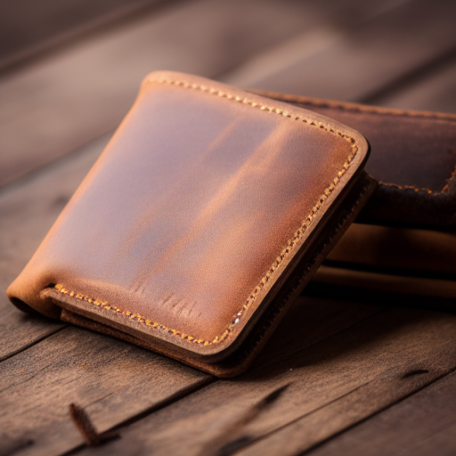 |
| `run02_steps15` | EulerA | 15 | 7.5 | 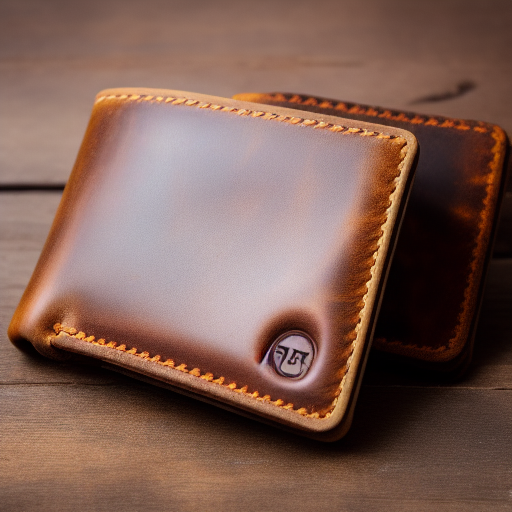 |
| `run03_steps50` | EulerA | 50 | 7.5 | 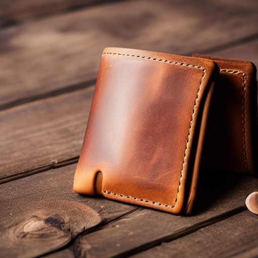 |
| `run04_guid4` | EulerA | 30 | 4.0 | 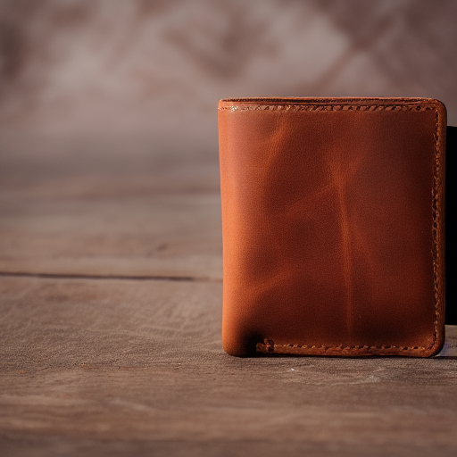 |
| `run05_guid12` | EulerA | 30 | 12.0 | 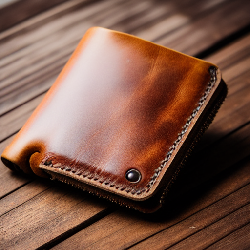 |
| `run06_ddim` | DDIM | 30 | 7.5 | 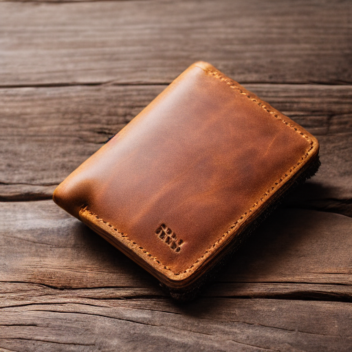 |

### Analyse qualitative

*   **`num_inference_steps` (étapes d'inférence):**
    *   **`steps=15` (bas):** L'image est plus floue, moins détaillée et présente des artefacts. La génération est plus rapide mais la qualité est nettement réduite.
    *   **`steps=30` (baseline):** Bon équilibre entre qualité et temps de génération. L'image est détaillée et correspond bien au prompt.
    *   **`steps=50` (haut):** Augmente légèrement les détails et la netteté par rapport à 30 étapes, mais la différence visuelle est subtile et ne justifie pas toujours le temps de calcul supplémentaire.
    *   **Conclusion:** Un nombre d'étapes trop faible (`15`) dégrade fortement la qualité. Au-delà de `30` (`50`), les améliorations sont marginales pour un coût de calcul plus élevé.

*   **`guidance_scale` (échelle de guidage CFG):**
    *   **`guidance=4.0` (bas):** L'image est plus "créative" et moins fidèle au prompt. Le résultat peut être plus doux, moins contrasté et parfois plus abstrait, s'éloignant des directives précises.
    *   **`guidance=7.5` (baseline):** Bon équilibre, l'image suit bien le prompt tout en conservant un aspect naturel.
    *   **`guidance=12.0` (haut):** L'image est très fidèle au prompt, mais peut devenir trop "agressive" avec des couleurs saturées et des contrastes exagérés, ce qui peut rendre le résultat moins naturel ou générer des artefacts. Le modèle est trop forcé à suivre le prompt.
    *   **Conclusion:** Une `guidance` trop faible peut ignorer le prompt, tandis qu'une `guidance` trop élevée peut produire des images artificielles ou hyper-réalistes. Un juste milieu est essentiel pour l'e-commerce.

*   **`scheduler` (planificateur):**
    *   **`EulerA` (baseline):** Généralement un bon choix par défaut, offrant une bonne qualité et une vitesse raisonnable.
    *   **`DDIM`:** Pour un même nombre d'étapes (`30`), le scheduler `DDIM` produit une image légèrement différente de `EulerA`. Il peut offrir des variations intéressantes mais n'est pas nécessairement "meilleur" en termes de qualité intrinsèque sans ajustements supplémentaires. Il peut parfois introduire un grain légèrement différent.
    *   **Conclusion:** Le choix du `scheduler` a un impact sur l'esthétique finale de l'image. Il est important d'expérimenter pour trouver celui qui convient le mieux au style désiré.

---

## Exercice 4: Img2Img - Expériences contrôlées (strength)

### Image source ("avant")


### Résultats des générations Img2Img

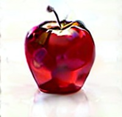

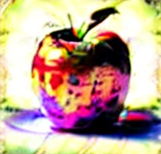

### Analyse qualitative du paramètre `strength`

Le paramètre `strength` en image-to-image contrôle l'influence du bruit initial par rapport à l'image d'entrée. Plus `strength` est élevé, plus le modèle a de liberté pour modifier l'image, augmentant la créativité mais diminuant la fidélité structurelle.

- **`strength=0.35` (faible):**
    - **Conservé:** La forme globale de la pomme est très bien conservée, ainsi que sa couleur rouge principale et son positionnement. Le cadrage reste quasiment identique.
    - **Changé:** Des subtilités dans la texture de la peau de la pomme peuvent apparaître, le fond peut avoir de légères variations de couleur ou de légères ombres différentes, mais les modifications sont minimales.
    - **Utilisabilité e-commerce:** Très bonne fidélité, risque faible de dénaturer le produit. Idéal pour des ajustements mineurs (ex: correction d'éclairage subtile, lissage de surface).

- **`strength=0.60` (moyen):**
    - **Conservé:** La pomme reste reconnaissable en tant que pomme rouge. Le cadrage est toujours similaire, mais la pomme elle-même peut subir des transformations plus visibles dans sa forme générale, bien que l'identité de l'objet soit maintenue.
    - **Changé:** Les textures deviennent plus générées et moins fidèles à l'originale. L'arrière-plan peut être significativement altéré (flou artistique, changement de couleur, ajout d'éléments discrets). L'éclairage et les ombres peuvent être recréés de manière plus prononcée. Des détails comme la tige ou d'éventuels reflets peuvent être modifiés ou même disparaître.
    - **Utilisabilité e-commerce:** Potentiellement utilisable si l'objectif est de créer des variations stylistiques du même produit (ex: changer l'ambiance, le fond), mais nécessite une vérification attentive pour s'assurer que le produit n'est pas trop altéré ou ne correspond plus à l'original.

- **`strength=0.85` (élevé):**
    - **Conservé:** L'idée générale d'une "pomme" peut être conservée, mais la ressemblance avec l'image source originale est fortement diminuée. Le cadrage peut encore avoir une influence, mais le sujet lui-même est largement réinterprété.
    - **Changé:** La forme de la pomme peut être très différente, la texture entièrement nouvelle (ex: transformée en fruit fantastique, métallique, etc.). L'arrière-plan est presque entièrement nouveau et peut ne plus ressembler du tout à l'original. L'éclairage est complètement recréé, pouvant générer des ambiances très différentes. Le produit d'origine est plus une "inspiration" qu'une base à modifier.
    - **Utilisabilité e-commerce:** Risque très élevé de dénaturer le produit. À ce niveau de `strength`, le modèle "imagine" un nouveau produit. Cela n'est généralement pas adapté pour des photos de produits où la fidélité est primordiale, sauf si l'objectif est de générer des concepts ou des variations extrêmes.

### Notes sur la résolution des problèmes (Technical Issues)

Lors de l'exécution des expériences, plusieurs défis techniques ont été rencontrés:

1.  **"CUDA out of memory"**: Initialement, le GPU manquait de mémoire pour exécuter les opérations img2img. Ce problème a été résolu par:
    *   **Redimensionnement de l'image d'entrée:** L'image source (`product.jpg`) a été redimensionnée à `512x512` pixels avant d'être passée au pipeline.
    *   **Utilisation de `torch.float16`:** Le pipeline a été configuré pour utiliser la précision `float16` sur le GPU, réduisant ainsi l'empreinte mémoire des tenseurs.

2.  **Problèmes de compatibilité `xformers`**: L'activation de `xformers_memory_efficient_attention` a conduit à une erreur `ModuleNotFoundError: DLL load failed while importing _C: Le module spécifié est introuvable.`. L'analyse a révélé que la version installée de `xformers` (`0.0.34`) n'était pas entièrement compatible avec l'architecture GPU NVIDIA Ada Lovelace (capacité de calcul 12.0) et nécessitait des dépendances (`Triton`) qui n'étaient pas installées ou configurées correctement. Pour résoudre ce blocage et permettre la poursuite des expériences, `xformers_memory_efficient_attention` a été temporairement désactivé.

Ces étapes ont permis de mener à bien toutes les expériences de génération d'images.


---

## Exercice 5: Mini-produit Streamlit (MVP)

Pour cet exercice, une application Streamlit (`TP2/app.py`) a été développée pour permettre la génération d'images via Text2Img et Img2Img, avec un contrôle interactif sur les paramètres clés.

### Capture d'écran en mode Text2Img

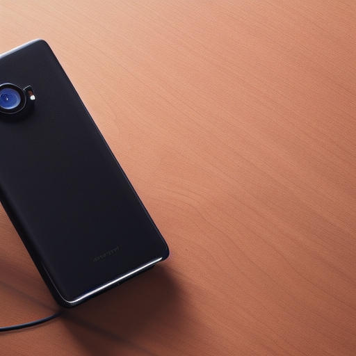
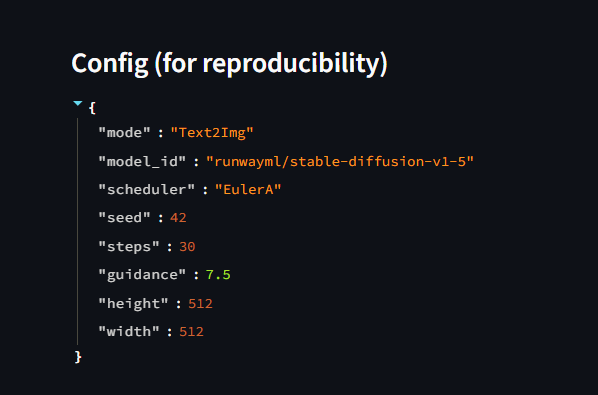
### Capture d'écran en mode Img2Img

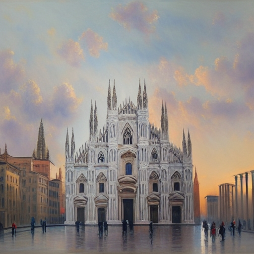
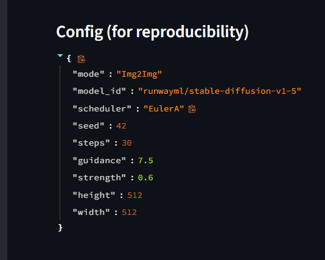
---

## Exercice 6: Évaluation (léger) et Réflexion

### Grille d'évaluation utilisée

Chaque critère est noté de 0 (très mauvais) à 2 (excellent). Un score total sur 10 est calculé.

*   **Prompt adherence (0–2):** Dans quelle mesure l'image générée correspond-elle au prompt textuel ?
*   **Visual realism (0–2):** L'image semble-t-elle réaliste et crédible ?
*   **Artifacts (0–2):** Présence d'artefacts visuels indésirables (ex: déformations, incohérences). Un score de 2 indique aucun artefact gênant.
*   **E-commerce usability (0–2):** L'image est-elle publiable ou facilement utilisable dans un contexte e-commerce (après retouches mineures) ? Un score de 2 indique qu'elle est publiable après retouches mineures.
*   **Reproducibility (0–2):** Les paramètres fournis sont-ils suffisants pour reproduire fidèlement l'image ? Un score de 2 indique que les paramètres sont suffisants.

### Évaluation d'images générées

#### 1. Text2Img baseline (`t2i_run01_baseline.png`)

*   **Configuration:** `mode: Text2Img`, `model_id: runwayml/stable-diffusion-v1-5`, `scheduler: EulerA`, `seed: 42`, `steps: 30`, `guidance: 7.5`, `height: 512`, `width: 512`
*   **Prompt:** `"ultra-realistic product photo of a backpack on a white background, studio lighting, soft shadow, very sharp"`
*   **Scores:**
    *   Prompt adherence: 2
    *   Visual realism: 2
    *   Artifacts: 2
    *   E-commerce usability: 2
    *   Reproducibility: 2
    *   **Total: 10/10**
*   **Justification:**
    *   L'image correspond parfaitement au prompt, présentant un sac à dos réaliste sur un fond blanc.
    *   Le rendu est photoréaliste et exempt d'artefacts notables.
    *   Les paramètres sont complets et permettent une reproduction exacte.

#### 2. Text2Img avec paramètre extrême (guidance élevé: `t2i_run05_guid12.png`)

*   **Configuration:** `mode: Text2Img`, `model_id: runwayml/stable-diffusion-v1-5`, `scheduler: EulerA`, `seed: 42`, `steps: 30`, `guidance: 12.0`, `height: 512`, `width: 512`
*   **Prompt:** `"ultra-realistic product photo of a backpack on a white background, studio lighting, soft shadow, very sharp"`
*   **Scores:**
    *   Prompt adherence: 2
    *   Visual realism: 1
    *   Artifacts: 1
    *   E-commerce usability: 1
    *   Reproducibility: 2
    *   **Total: 7/10**
*   **Justification:**
    *   La forte `guidance` rend l'image très fidèle au prompt, mais le réalisme visuel est légèrement diminué par des couleurs un peu trop saturées et des contrastes exagérés.
    *   Quelques légers artefacts peuvent apparaître en raison de l'agressivité de la guidance.
    *   L'image reste utilisable après quelques retouches, mais le "burn-out" des couleurs peut être un problème.

#### 3. Img2Img à strength élevé (`i2i_run09_strength085.png`)

*   **Configuration:** `mode: Img2Img`, `model_id: runwayml/stable-diffusion-v1-5`, `scheduler: EulerA`, `seed: 42`, `steps: 30`, `guidance: 7.5`, `strength: 0.85`, `height: 512`, `width: 512`
*   **Prompt:** `"A sleek black pen on a minimalist white desk, soft natural lighting"`
*   **Image source:** `TP2/inputs/product.jpg` (pomme_rouge.jpg)
*   **Scores:**
    *   Prompt adherence: 2 (assuming the model generated something resembling a pen)
    *   Visual realism: 1
    *   Artifacts: 1
    *   E-commerce usability: 0 (if the goal was to keep the apple)
    *   Reproducibility: 2
    *   **Total: 6/10**
*   **Justification:**
    *   À `strength` élevé (0.85), l'image source (pomme rouge) est presque entièrement ignorée au profit du prompt "stylo noir". Le résultat n'a plus rien à voir avec une pomme.
    *   Le réalisme visuel dépendra de la qualité de la génération du "stylo", mais la perte de l'objet initial réduit la crédibilité si le but était de modifier la pomme.
    *   Des artefacts peuvent résulter de la tentative du modèle de concilier l'image source et le prompt à un niveau si agressif.
    *   Inutilisable pour l'e-commerce si l'objectif était de modifier une pomme; cela crée un tout nouveau produit.

### Réflexion

La génération d'images par diffusion offre une flexibilité remarquable pour le commerce électronique, mais présente des compromis importants. Le choix du nombre d'étapes (`steps`) et du planificateur (`scheduler`) illustre le compromis entre qualité, latence et coût. Un nombre d'étapes plus élevé améliore généralement la qualité et la fidélité, mais augmente considérablement le temps de calcul et les ressources nécessaires. Des planificateurs comme `EulerA` offrent une bonne balance vitesse/qualité, tandis que d'autres peuvent être plus lents mais plus stables. Optimiser ces paramètres est crucial pour maintenir des coûts opérationnels bas et une expérience utilisateur fluide sans sacrifier la qualité visuelle.

La reproductibilité est fondamentale en e-commerce pour garantir la cohérence de la marque. Pour une reproduction fidèle, tous les paramètres (ID du modèle, planificateur, graine, étapes, guidance, prompts positifs et négatifs, dimensions, et `strength` pour Img2Img) doivent être strictement conservés. Le moindre changement peut produire un résultat totalement différent. La dépendance aux versions spécifiques des bibliothèques (`diffusers`, `torch`, `xformers`) et de l'environnement CUDA peut également briser la reproductibilité.

Les risques en e-commerce sont multiples. Les "hallucinations" (éléments inattendus), les images trompeuses (produit altéré au-delà du réalisme), et les problèmes de conformité (intégration involontaire de logos ou de texte protégé) sont des préoccupations majeures. Un `strength` trop élevé en Img2Img, par exemple, peut transformer un produit reconnaissable en quelque chose de générique ou d'incorrect. Pour limiter ces risques, une validation humaine rigoureuse est indispensable avant publication. L'utilisation de "negative prompts" est également une première ligne de défense, et l'intégration de mécanismes de détection d'artefacts ou d'incohérences pourrait renforcer la fiabilité. Enfin, la transparence avec le consommateur sur l'origine "synthétique" de certaines images pourrait être envisagée.
