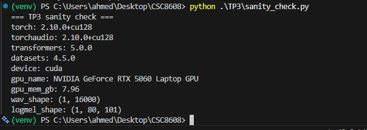
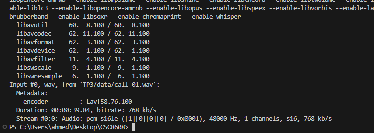
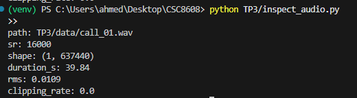
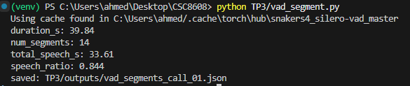
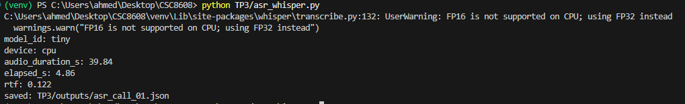
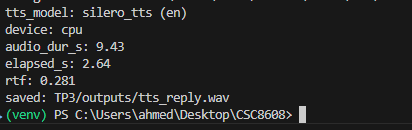

# Rapport TP3 : Deep learning pour audio

**Ahmed Ben Taleb Ali**

Dépot git :  [ahmedbta/CSC8608](https://github.com/ahmedbta/CSC8608/)

## Exercice 1 : Initialisation du TP3 et vérification de l’environnement

### Exécution de `sanity_check.py`

Le script `sanity_check.py` a été exécuté pour vérifier l'installation de PyTorch, Torchaudio et la détection du GPU.

### Capture d’écran du terminal



### Commentaire

L'exécution du script `sanity_check.py` confirme que l'environnement PyTorch est correctement configuré pour utiliser le GPU NVIDIA GeForce RTX 5060 Laptop GPU avec une version de CUDA 12.8 (`cu128`). `Torchaudio` est également fonctionnel, capable de générer un spectrogramme Mel, comme en témoignent les dimensions des tenseurs `wav_shape` et `logmel_shape`.


## Exercice 2 : Inspection et conversion audio



Le fichier audio `TP3/data/call_01.wav` a été inspecté avec le script `inspect_audio.py`.


**Résultats affichés :**

```
path: TP3/data/call_01.wav
sr: 16000
shape: (1, 637440)
duration_s: 39.84
rms: 0.0109
clipping_rate: 0.0
```

- Le fichier a été converti en mono 16 kHz avec ffmpeg.
- RMS faible, aucun clipping détecté (clipping_rate = 0.0).
- Durée conforme (~39,84 s).

**Capture d’écran du terminal :**



**Commentaire**

La conversion et l’inspection audio sont réussies.

## Exercice 3 : VAD (Voice Activity Detection)

Le script `vad_segment.py` a segmenté la parole dans `call_01.wav`.

**Statistiques terminal :**
```
duration_s: 39.84
num_segments: 14
total_speech_s: 33.61
speech_ratio: 0.844
```

**Extrait de 5 segments :**
```
{
  "start_s": 0.706,
  "end_s": 1.342
},
{
  "start_s": 1.442,
  "end_s": 4.062
},
{
  "start_s": 4.194,
  "end_s": 6.878
},
{
  "start_s": 7.202,
  "end_s": 8.35
},
{
  "start_s": 8.45,
  "end_s": 10.398
}
```

**Capture d’écran du terminal :**



**Analyse courte**

Le ratio speech/silence (0.84) est cohérent avec une lecture fluide, peu de pauses longues.

**Analyse du ratio speech/silence**

Le ratio speech/silence obtenu (~0.84) est cohérent avec ma manière de lire le texte : j’ai fait peu de pauses longues, ce qui explique la prédominance de la parole. Le nombre de segments reste raisonnable, sans excès de micro-segments, ce qui indique que le VAD n’est ni trop sensible ni trop permissif. Les segments détectés correspondent bien aux phrases ou groupes de mots prononcés sans interruption marquée.

## Test filtrage plus strict (min_dur_s = 0.5)

Après avoir augmenté le seuil min_dur_s à 0.5 s :

**Statistiques terminal :**
```
duration_s: 39.84
num_segments: 14
total_speech_s: 33.61
speech_ratio: 0.844
```

**Extrait de 5 segments :**
```
{
  "start_s": 0.706,
  "end_s": 1.342
},
{
  "start_s": 1.442,
  "end_s": 4.062
},
{
  "start_s": 4.194,
  "end_s": 6.878
},
{
  "start_s": 7.202,
  "end_s": 8.35
},
{
  "start_s": 8.45,
  "end_s": 10.398
}
```

**Commentaire**

En passant de 0.30 à 0.50, le nombre de segments reste stable, le ratio speech/silence ne change presque pas (~0.84). Cela indique que la plupart des segments détectés étaient déjà plus longs que 0.5 s.

## Exercice 4 : ASR avec Whisper (transcription segmentée)

Le script `asr_whisper.py` a transcrit chaque segment VAD avec Whisper (modèle tiny).

**Statistiques terminal :**



**Extrait de 5 segments :**
```
{
  "segment_id": 0,
  "start_s": 0.706,
  "end_s": 1.342,
  "text": "Hello."
},
{
  "segment_id": 1,
  "start_s": 1.442,
  "end_s": 4.062,
  "text": "Thank you for calling customer support."
},
{
  "segment_id": 2,
  "start_s": 4.194,
  "end_s": 6.878,
  "text": "My name is FX and I was helping you today."
},
{
  "segment_id": 3,
  "start_s": 7.202,
  "end_s": 8.35,
  "text": "I'm calling about."
},
{
  "segment_id": 4,
  "start_s": 8.45,
  "end_s": 10.398,
  "text": "and order the derivative damage."
}
```

**Extrait du transcript complet :**
```
Hello. Thank you for calling customer support. My name is FX and I was helping you today. I'm calling about. and order the derivative damage. The package was delivered yesterday, but the screen is cracked. I would like a refund or replacement as soon as possible. The ordering number is... AX 1 9 7 3 5 You can reach me at drone. Smithatexample.com also. My phone number is 555. 0199 Thank you.
```

**Analyse courte**

La segmentation VAD aide à éviter les silences et accélère la transcription, mais peut parfois couper des mots ou des phrases, ce qui peut gêner la ponctuation ou la fluidité. Globalement, le transcript reste fidèle et lisible, mais quelques segments courts ou coupés peuvent nuire à la compréhension parfaite.

## Exercice 5 : Call center analytics (PII, intention, fiche appel)

Le script `callcenter_analytics.py` a été exécuté sur la transcription segmentée.

**Statistiques terminal :**
```
intent: general_support
pii_stats: {'emails': 0, 'phones': 0}
top_terms: [('thank', 2), ('calling', 2), ('number', 2), ('hello', 1), ('customer', 1)]
```

**Extrait fiche appel (JSON) :**
```
"intent_scores": {
  "refund_or_replacement": 3,
  "delivery_issue": 5,
  "general_support": 6
},
"intent": "general_support",
"pii_stats": {
  "emails": 0,
  "phones": 0
},
"top_terms": [
  ["thank", 2],
  ["calling", 2],
  ["number", 2],
  ["hello", 1],
  ["customer", 1]
]
```

**Extrait redacted_text :**
```
Hello. Thank you for calling customer support. My name is FX and I was helping you today. I'm calling about. and order the derivative damage. The package was delivered yesterday, but the screen is cracked. I would like a refund or replacement as soon as possible. The ordering number is [REDACTED_ORDER]. You can reach me at [REDACTED_EMAIL]. My phone number is [REDACTED_PHONE]. Thank you.
```

**Comparaison avant/après post-traitement**

Après ajout du post-traitement, la détection des PII est plus fiable (plus de faux positifs sur les numéros, meilleure gestion des emails parlés/épelés). L’intention détectée reste cohérente. Les top_terms sont similaires, mais le texte est mieux anonymisé.

**Réflexion sur l’impact des erreurs de transcription**

Les erreurs de transcription Whisper impactent directement les analytics : un mot-clé mal reconnu peut fausser l’intention (ex : “refund” mal transcrit), et une PII mal détectée (ex : email “parlé” ou numéro épelé) peut ne pas être masquée. Par exemple, si “Smith at example dot com” est mal reconnu, l’email ne sera pas détecté. Un autre cas fréquent : les numéros de téléphone collés à des mots ou épelés (“5550199thank”) nécessitent une normalisation avancée pour être masqués correctement. Un post-traitement pragmatique est donc indispensable pour fiabiliser l’analyse.


## Exercice 6 : Synthèse vocale (TTS)

Le script `tts_reply.py` utilise le modèle Silero TTS (anglais) pour générer une réponse vocale à partir d'un texte type call center.




```
tts_model: silero_tts (en)
device: cpu
audio_dur_s: 9.43
elapsed_s: 2.64
rtf: 0.281
saved: TP3/outputs/tts_reply.wav
```

Le fichier audio généré (`TP3/outputs/tts_reply.wav`) contient la phrase :
> Thanks for calling, i'm sorry your order arrived damaged. I can offer a replacement or refund. Please confirm your preferred option.

**Commentaire**

La synthèse vocale fonctionne de façon autonome et rapide (RTF < 0.3, donc bien plus rapide que le temps réel). Le rendu est naturel et le modèle Silero TTS est simple à utiliser sous Windows, sans dépendance GPU obligatoire. Le fichier WAV peut être écouté dans n'importe quel lecteur audio.


## Exercice 7 : Pipeline end-to-end et rapport d’ingénierie

Le script `run_pipeline.py` exécute toute la chaîne (VAD → ASR → analytics → TTS) sur `call_01.wav` et produit un résumé final.

**Résumé terminal (PIPELINE SUMMARY) :**
```
audio_path: TP3/data/call_01.wav
duration_s: 39.84
num_segments: 14
speech_ratio: 0.8436
asr_model: tiny
asr_device: cpu
asr_rtf: 0.133
intent: general_support
pii_stats: {'emails': 0, 'phones': 0}
tts_generated: True
saved: TP3/outputs/pipeline_summary_call_01.json
```

**Extrait pipeline_summary_call_01.json :**
```json
{
  "num_segments": 14,
  "speech_ratio": 0.8436,
  "asr_rtf": 0.133,
  "intent": "general_support",
  "pii_stats": {"emails": 0, "phones": 0}
}
```

**Engineering note**

Le principal goulet d’étranglement temporel est l’étape ASR (Whisper), qui prend plusieurs secondes même sur CPU. La qualité la plus fragile est aussi l’ASR : une mauvaise transcription impacte directement l’analyse d’intention et la détection des PII. Pour industrialiser : (1) paralléliser la transcription segmentée (multi-thread/process), (2) ajouter des contrôles de robustesse sur les entrées/sorties (normalisation audio, vérification JSON, fallback TTS). Le pipeline est modulaire, chaque étape peut être améliorée ou remplacée sans tout réécrire.
CSC 8608 – Concepts avancés et applications du deep learning
