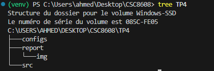
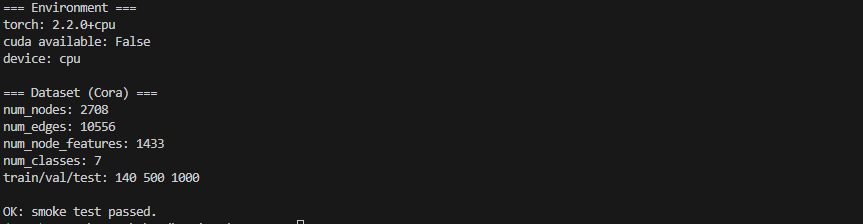
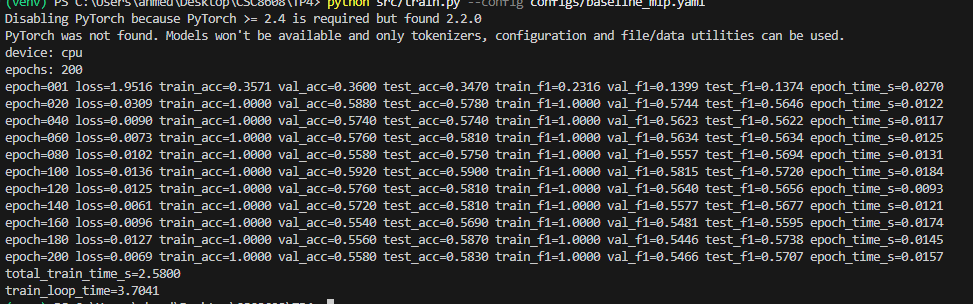
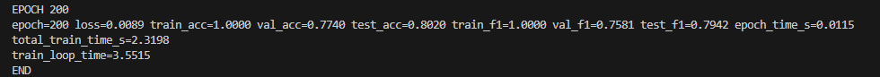
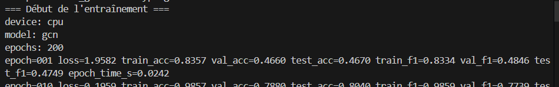
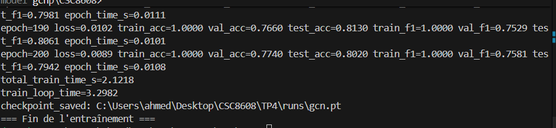
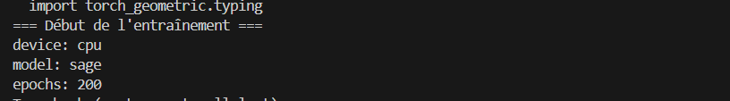
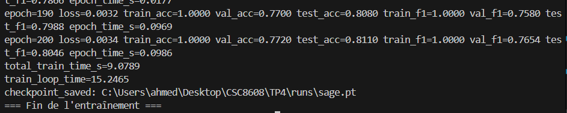

# Rapport TP4

**Ahmed Ben Taleb Ali**

Dépôt git : [ahmedbta/CSC8608](https://github.com/ahmedbta/CSC8608/)

---

# Exercice 1 : Initialisation du TP et smoke test PyG (Cora)

## Structure du dossier



## Résultats du smoke test



```
=== Environment ===
torch: 2.2.0+cpu
cuda available: False
device: cpu

=== Dataset (Cora) ===
num_nodes: 2708
num_edges: 10556
num_node_features: 1433
num_classes: 7
train/val/test: 140 500 1000

OK: smoke test passed.
```

---

# Exercice 2 : Baseline tabulaire MLP

## Résultats d'entraînement (MLP)

Configuration utilisée :

```yaml
seed: 42
device: "cuda"
epochs: 200
lr: 0.01
weight_decay: 5e-4
mlp:
  hidden_dim: 64
  dropout: 0.5
```

Sortie terminale (extrait) :

```
device: cpu
epochs: 200
epoch=001 loss=1.9516 train_acc=0.3571 val_acc=0.3600 test_acc=0.3470 ...
epoch=020 loss=0.0309 train_acc=1.0000 val_acc=0.5880 test_acc=0.5780 ...
epoch=200 loss=0.0069 train_acc=1.0000 val_acc=0.5580 test_acc=0.5830 train_f1=1.0000 val_f1=0.5466 test_f1=0.5707 epoch_time_s=0.0157
total_train_time_s=2.5800
train_loop_time=3.7041
```



## Pourquoi calculer les métriques sur train_mask, val_mask et test_mask séparément

Le `train_mask` sert à voir si le modèle apprend : ici `train_acc` atteint rapidement 1.0 ce qui montre que le MLP mémorise bien les 140 nœuds d'entraînement. Le `val_mask` permet de détecter l'overfitting en cours de run (val_acc stagne autour de 0.55 alors que train_acc est à 1.0, écart typique). Le `test_mask` est réservé pour l'évaluation finale uniquement — on n'ajuste rien en fonction de lui. Les avoir séparés permet de voir ce diagnostic directement dans le log epoch par epoch, sans avoir à relancer quoi que ce soit.

---

## Résultats d'entraînement (GCN)

Configuration utilisée :

```yaml
seed: 42
device: "cuda"
epochs: 200
lr: 0.01
weight_decay: 5e-4
gcn:
  hidden_dim: 64
  dropout: 0.5
```

Sortie terminale (extrait) :

```
device: cpu
model: gcn
epochs: 200
epoch=001 loss=1.9582 train_acc=0.8357 val_acc=0.4660 test_acc=0.4670 ...
epoch=100 loss=0.0102 train_acc=1.0000 val_acc=0.7740 test_acc=0.8020 ...
epoch=200 loss=0.0089 train_acc=1.0000 val_acc=0.7740 test_acc=0.8020 train_f1=1.0000 val_f1=0.7581 test_f1=0.7942 epoch_time_s=0.0115
total_train_time_s=2.3198
train_loop_time=3.5515
```



## Tableau de comparaison MLP vs GCN

| Modèle | test_acc | test_f1 | total_train_time_s |
|--------|----------|---------|--------------------|
| MLP    | 0.5830   | 0.5707  | 2.58               |
| GCN    | 0.8020   | 0.7942  | 2.32               |

## Analyse MLP vs GCN

L'écart est net : +21.9 pts d'accuracy et +22.4 pts de macro-F1 pour GCN contre MLP. Cora est un graphe homophile — les papiers qui se citent sont généralement dans le même domaine, donc agréger les voisins aide vraiment. Le MLP travaille uniquement sur les features bag-of-words qui sont assez sparses (1433 dims), sans profiter de cette info structurelle. Ce qui est intéressant c'est que le temps d'entraînement est quasi identique (2.58s vs 2.32s) : sur ce petit graphe, rajouter le message passing GCN ne coûte presque rien en full-batch.

---

# Exercice 3 : GraphSAGE avec neighbor sampling

## Résultats d'entraînement (GraphSAGE)

Configuration utilisée :

```yaml
seed: 42
device: "cuda"
epochs: 200
lr: 0.01
weight_decay: 5e-4
sage:
  hidden_dim: 64
  dropout: 0.5
sampling:
  batch_size: 128
  num_neighbors_l1: 10
  num_neighbors_l2: 10
```

Sortie terminale (extrait) :

```
device: cpu
model: sage
epochs: 200
epoch=001  ...
epoch=100  loss=0.0032 train_acc=1.0000 val_acc=0.7700 test_acc=0.8080 train_f1=1.0000 val_f1=0.7580 test_f1=0.7988 epoch_time_s=0.0969
epoch=200  loss=0.0034 train_acc=1.0000 val_acc=0.7720 test_acc=0.8110 train_f1=1.0000 val_f1=0.7654 test_f1=0.8046 epoch_time_s=0.0986
total_train_time_s=9.0789
train_loop_time=15.2465
checkpoint_saved: C:\Users\ahmed\Desktop\CSC8608\TP4\runs\sage.pt
```



## Tableau de comparaison MLP / GCN / GraphSAGE

| Modèle    | test_acc | test_f1 | total_train_time_s |
|-----------|----------|---------|--------------------|
| MLP       | 0.5830   | 0.5707  | 2.58               |
| GCN       | 0.8020   | 0.7942  | 2.32               |
| GraphSAGE | 0.8110   | 0.8046  | 9.08               |

## Compromis du neighbor sampling

Avec `num_neighbors=[10, 10]`, à chaque step on ne propage les messages que sur un sous-graphe d'environ 100 nœuds par nœud seed (10 voisins × 10 voisins de voisins) au lieu du graphe complet. Sur un grand graphe avec des millions de nœuds ça devient indispensable — on ne peut pas faire de forward full-batch. Le problème c'est que le gradient calculé sur ce sous-graphe n'est qu'une estimation du vrai gradient : les nœuds hubs (très connectés) ont une forte chance d'être sous-représentés dans un batch donné, ce qui introduit du bruit. Autre inconvénient concret : le sampling lui-même coûte du CPU (construire le sous-graphe, faire les lookups d'adjacence) et si le GPU est rapide ça peut devenir le goulot d'étranglement. Sur Cora c'est flagrant : 9.1s contre 2.3s pour GCN full-batch, alors que Cora est minuscule. Le sampling n'a de sens ici qu'à titre pédagogique.

---

# Exercice 4 : Benchmarks ingénieur

## Latence d'inférence (benchmark forward pass)






## Tableau synthétique final

| Modèle    | test_acc | test_macro_f1 | total_train_time_s | train_loop_time |
|-----------|----------|---------------|--------------------|-----------------|
| MLP       | 0.5830   | 0.5707        | 2.5800             | 3.7041          | 
| GCN       | 0.8020   | 0.7942        | 2.3198             | 3.5515          | 
| GraphSAGE | 0.8110   | 0.8046        | 9.0789             | 15.2465         | 

## Warmup GPU et synchronisation CUDA

Ici les mesures tournent sur CPU (pas de GPU disponible), donc le warmup sert surtout à stabiliser les mesures CPU : chargement des données en cache L1/L2, initialisation des threads PyTorch, etc. Sur GPU le warmup est encore plus critique parce que le premier forward déclenche la compilation des kernels CUDA — cuDNN choisit l'algorithme de convolution optimal selon la taille des tenseurs, ce qui prend plusieurs dizaines de ms. Sans warmup, cette mesure parasite serait incluse dans la moyenne.

La synchronisation `torch.cuda.synchronize()` est nécessaire sur GPU parce que les opérations sont lancées de façon asynchrone : l'appel Python retourne immédiatement, mais le GPU est encore en train d'exécuter. Si on mesure le temps sans synchroniser, on mesure juste le temps de soumission côté CPU (quelques µs), pas le vrai temps d'exécution. Ici sur CPU ce n'est pas un problème — les ops sont synchrones — mais le code le fait quand même pour être portable GPU.

---

# Exercice 5 : Synthèse et recommandations

## Recommandation ingénieur

Si je devais choisir un modèle pour re-déployer ce pipeline : **GCN** sans hésiter sur un graphe de taille comparable à Cora. Il gagne +21.9 pts d'accuracy par rapport au MLP (0.8020 vs 0.5830) pour pratiquement le même temps d'entraînement (2.32s vs 2.58s). C'est un bon rapport qualité/coût. Le **MLP** ne sert que si on n'a pas accès au graphe ou si on veut une baseline de référence rapide. Le **GraphSAGE** est pertinent quand le graphe est trop grand pour tenir en mémoire GPU en full-batch — le mini-batch sampling devient alors obligatoire. Ici sur Cora il coûte 4x plus en temps (9.1s) pour seulement +1 pt d'accuracy sur GCN, ce qui ne justifie pas son utilisation. En production sur un grand graphe, GraphSAGE serait probablement le seul choix viable.

## Risque de protocole

Le risque principal ici c'est qu'on compare les modèles sur une seule run avec seed=42 fixe. Sur Cora, l'accuracy de GCN varie d'environ ±1 pt selon l'initialisation, donc une seule mesure suffit à peine pour conclure. Pour une comparaison sérieuse il faudrait au moins 3-5 seeds et reporter la moyenne avec l'écart-type. Deuxième problème : toutes les mesures sont faites sur CPU (pas de GPU disponible), ce qui peut inverser les conclusions sur les temps — le mini-batch SAGE devrait être plus avantageux sur GPU que le full-batch GCN, mais ici le surcoût CPU du sampling domine. Enfin un détail pratique : la première run est toujours plus lente à cause du cache PyG (téléchargement + preprocessing du graphe). Si on avait mesuré le temps de la première exécution vs les suivantes, les chiffres auraient été faussés.
