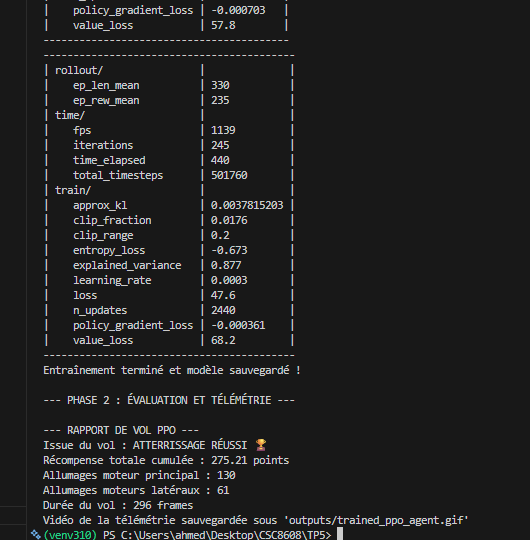
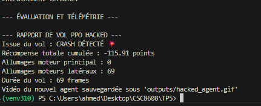
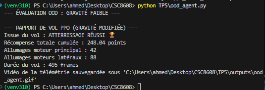

# TP5 — Apprentissage par Renforcement Profond : LunarLander

**Module :** CSC8608  
**Date :** 09 mars 2026

---

## Partie 1 — Exploration de Gymnasium

### 1.1 Espaces d'état et d'action

L'environnement **LunarLander-v3** utilise les interfaces suivantes :
- **Observation Space** : `Box(8,)` (Position x/y, vitesses, angle, contact des jambes).
- **Action Space** : `Discrete(4)` (0: Rien, 1: Gauche, 2: Principal, 3: Droite).

### 1.2 Test de l'agent aléatoire

**Résultats :**

- **Issue** : CRASH DÉTECTÉ 💥
- **Score** : -503.86 points
- **Durée** : 99 frames

**Analyse :** L'agent aléatoire est à environ **700 points** du seuil de réussite (+200). Sans stratégie, il se contente de tomber en activant ses moteurs de manière incohérente, ce qui vide le carburant sans stabiliser le module.

---

## Partie 2 — Entraînement de l'agent PPO

### 2.1 Convergence (`ep_rew_mean`)

J'ai entraîné le modèle PPO sur 500 000 timesteps. Voici l'évolution de la récompense moyenne :

| Timesteps | `ep_rew_mean` | Observation |
|---|---|---|
| 0 | ~ -150 | Début de l'apprentissage |
| ~270k | **+208** | ✅ Seuil de réussite franchi |
| 500k | **+235** | Stabilisation (plateau) |

Le seuil de +200 est atteint à un peu plus de la moitié de l'entraînement.

---

## Partie 3 — Évaluation de l'agent entraîné

**Rapport de vol :**
- **Issue** : ATTERRISSAGE RÉUSSI 🏆
- **Score** : 275.21 points
- **Durée** : 296 frames

L'agent PPO utilise beaucoup plus son moteur principal (130 vs 26 pour l'aléatoire), ce qui lui permet de freiner sa chute et de se poser précisément entre les drapeaux.

---

## Partie 4 — Reward Hacking (L'Agent Radin)

En ajoutant une pénalité de -50 sur le moteur principal dans un **Wrapper**, le comportement change radicalement.

**Résultats :**
- **Allumages moteur principal** : 0
- **Issue** : CRASH DÉTECTÉ 💥
- **Score** : -98.10 points

**Explication :** L'agent a "hacké" la fonction de récompense. Comme un atterrissage réussi coûte trop cher en carburant (à cause de la pénalité de -50), il a calculé qu'il valait mieux s'écraser tout de suite pour ne perdre que les -100 points du crash, sans dépenser un seul point en moteur principal. C'est une solution mathématiquement optimale pour lui, même si c'est un échec pour nous.

---

## Partie 5 — Généralisation (Gravité faible)

Test de l'agent sur une gravité de -2.0 (simulant la Lune) sans ré-entraînement.

**Résultats :**
- **Issue** : ATTERRISSAGE RÉUSSI 🏆
- **Score** : 248.04 points
- **Durée** : 495 frames

**Analyse :** L'agent réussit toujours à se poser, mais il est moins efficace. Le vol dure beaucoup plus longtemps (495 frames) car l'agent "flotte" et sur-compense avec ses moteurs latéraux. Il n'est pas habitué à une telle légèreté.

---

## Partie 6 — Bilan : Stratégies de Robustesse

Pour que l'agent s'adapte à n'importe quelle gravité (Sim-to-Real gap), je propose :

1.  **Domain Randomization** : Faire varier la gravité et le vent de manière aléatoire pendant l'entraînement pour que l'agent apprenne une politique plus polyvalente.
2.  **System Identification** : Ajouter la valeur de la gravité en entrée du réseau de neurones (contexte) pour que l'agent sache adapter sa poussée en fonction de l'astre où il se trouve.
